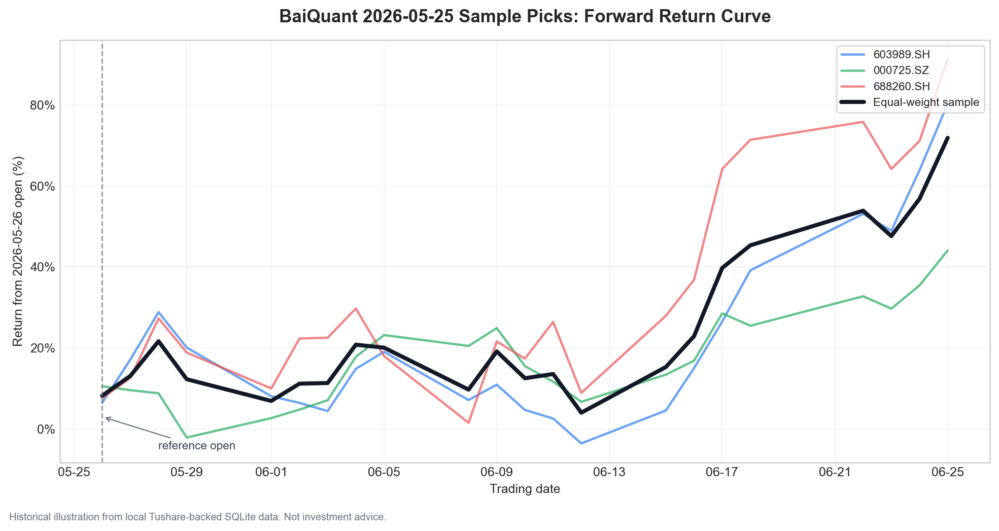
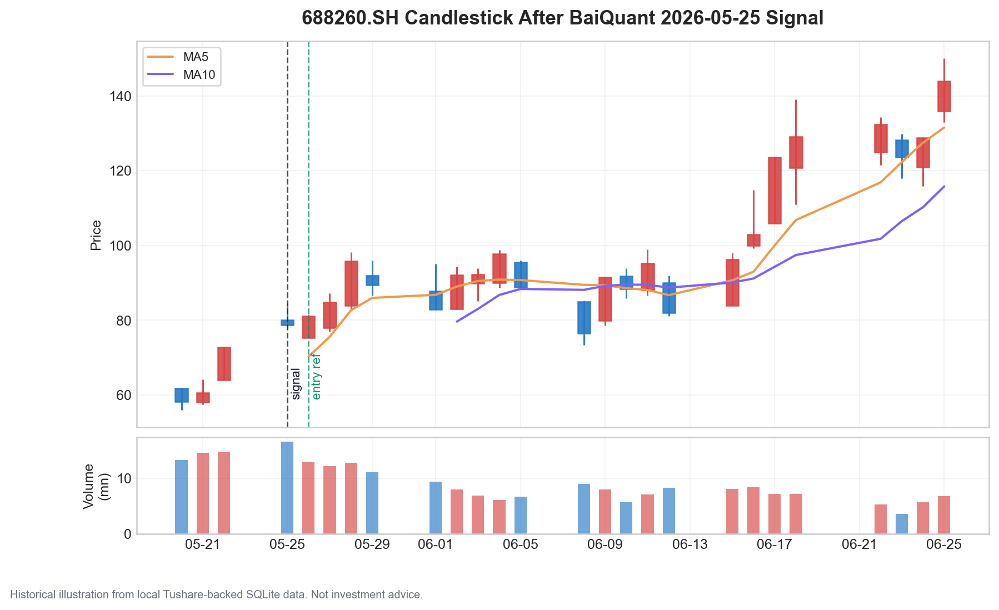

# BaiQuant

[English README](README.md) | [中文故事版 / Codex Series 01](README.zh-CN.md)

OpenAI Codex + GPT-5.5 assisted A-share quantitative finance research toolkit
for after-close stock selection, backtesting, paper replay, and manual trading
review.

**Case study:** [I gave an A-share account to Codex and doubled it in one
month](https://glbai.com/en/posts/codex-built-a-share-quant-strategy/)

> BaiQuant turns a daily A-share research routine into reproducible code: pull
> local data, rank candidates, review risk, record real fills, and learn from
> the next session.

| | |
| --- | --- |
| Built with | OpenAI Codex + GPT-5.5 |
| Research style | Harness-style loop: idea -> rule -> code -> test -> backtest -> review |
| Market focus | China A-share equities |
| Public strategy | `steady-20d` |
| Operating mode | after-close plan, next-session manual execution |
| Data stance | bring your own data; no proprietary market data is shipped |

BaiQuant is research infrastructure, not investment advice. It is designed for
individual researchers who want a local, inspectable workflow for A-share stock
selection, strategy experiments, and manual trading review.

## What It Does

- Builds a local A-share research database from your own market data.
- Screens a tradable universe with A-share constraints such as lot size, T+1,
  limit states, ST names, suspensions, liquidity, and board-specific filters.
- Produces after-close candidate lists for the next trading session.
- Backtests strategy changes and generates charts for review.
- Records manual trades in a local ledger so planned actions can be compared
  with actual fills.
- Provides a lightweight local Web UI for candidate review, holdings sync, and
  paper replay.

## Built With Codex And A Harness-Style Loop

BaiQuant's public strategy was co-created through an AI-assisted quantitative
finance workflow. A human user supplied the trading objective, account size,
market observations, screenshots, execution constraints, and risk preferences.
OpenAI Codex and GPT-5.5 were then used to turn those requirements into runnable
strategy code, tests, backtests, charts, documentation, and a local review UI.

The strategy was not designed as a black-box trading product. It was iterated in
a Harness-style evidence loop:

```text
human idea
  -> explicit trading rule
  -> implementation
  -> unit tests and fixture checks
  -> historical backtest
  -> failure review
  -> keep, revise, or reject
```

That loop matters because most strategy ideas look good in conversation and
become fragile once they meet real constraints: delayed after-close data,
limit-up/limit-down execution, position sizing, market-regime mismatch,
drawdown, and manual order placement. BaiQuant keeps those assumptions visible.

## Strategy Snapshot

The open-source strategy kept in this repository is **`steady-20d`**. It is a
short-cycle A-share stock-selection strategy built around:

- market participation and breadth checks;
- hotspot and industry relative strength;
- multi-factor technical ranking;
- liquidity and tradability filters;
- an approximately 20-trading-day holding horizon;
- next-open execution planning for manual trading;
- individual stops, trailing protection, and portfolio drawdown controls.

The goal is not to predict every day. The goal is to produce a small,
reviewable, consistently generated candidate list that a human trader can
inspect after the close.

Detailed notes:

- [docs/public_strategy.md](docs/public_strategy.md)
- [docs/live_20k_strategy.md](docs/live_20k_strategy.md)

## Historical Sample

The following sample was generated from a local Tushare-backed SQLite database.
The strategy was run after the close of **2026-05-25**, the first trading day
after 2026-05-23. Prices below assume the next session open on **2026-05-26** as
the reference execution price, then measure forward movement from daily bars.





| Code | Name | Entry Open | 5D Close Return | 10D Close Return | 20D Close Return | Best High In 20D |
| --- | --- | ---: | ---: | ---: | ---: | ---: |
| 603989.SH | 艾华集团 | 29.82 | +8.08% | +7.14% | +48.96% | +65.29% |
| 000725.SZ | 京东方A | 5.22 | +2.68% | +20.50% | +29.69% | +37.55% |
| 688260.SH | 昀冢科技 | 75.29 | +10.00% | +1.53% | +64.17% | +84.62% |

This is a historical illustration, not an expected return. It may reflect a
favorable market window, data-source assumptions, and strategy overfitting. Use
walk-forward tests and paper trading before putting real money behind any rule.

## Quick Start

Install locally:

```bash
python3 -m venv .venv
.venv/bin/pip install -e ".[dev]"
```

Run the test suite:

```bash
.venv/bin/python -m pytest -q
```

Try the bundled synthetic fixture data:

```bash
.venv/bin/baiquant sample-data --output-dir examples/data

.venv/bin/baiquant run \
  --prices examples/data/prices.csv \
  --stocks examples/data/stocks.csv \
  --fundamentals examples/data/fundamentals.csv \
  --events examples/data/events.csv \
  --start 2024-01-01 \
  --end 2024-01-10
```

## Real Data

BaiQuant does not include proprietary market data. For real A-share research,
create your own local database.

Create an environment file:

```bash
cp .env.example .env
```

Set your token locally:

```bash
export TUSHARE_TOKEN="your-token"
```

Ingest Tushare daily data into SQLite:

```bash
.venv/bin/baiquant ingest tushare \
  --output data/tushare/baiquant.db \
  --start 20230101 \
  --end 20260708 \
  --adjust qfq \
  --write-mode append \
  --resume
```

See [data/README.md](data/README.md) for the expected local data layout.

## Daily Workflow

Generate an after-close plan:

```bash
.venv/bin/baiquant live20k-2026 \
  --db data/tushare/baiquant.db \
  --as-of 2026-07-08 \
  --preset steady-20d \
  --cash 50000 \
  --plan-output data/paper/live20k_plan.csv
```

Start the local review desk:

```bash
.venv/bin/baiquant desk \
  --db data/tushare/baiquant.db \
  --host 127.0.0.1 \
  --port 8765
```

Record a manual trade in the local ledger:

```bash
.venv/bin/baiquant record-trade \
  --ledger data/live/trade_log.csv \
  --date 2026-07-08 \
  --code 600000.SH \
  --name ExampleA \
  --side buy \
  --price 10.00 \
  --shares 100
```

The ledger lets you compare planned actions with actual fills during manual
review.

## Repository Map

```text
src/baiquant/
  data/        Data providers and SQLite/CSV adapters
  strategy/    Stock-selection and execution planning logic
  research/    Factor research and regime validation helpers
  desk.py      Local Web UI server
  live_ledger.py
tests/         Unit and integration coverage
examples/      Small synthetic fixture data
docs/          Strategy and research notes
```

## Design Inspiration

BaiQuant is smaller and more opinionated than general-purpose quant frameworks.
Its focus is the practical after-close workflow of an individual A-share trader.
The project is inspired by:

- [backtrader](https://github.com/mementum/backtrader), a feature-rich Python
  framework for backtesting and trading;
- [vectorbt](https://github.com/polakowo/vectorbt), a fast vectorized research
  and backtesting toolkit;
- [Qlib](https://github.com/microsoft/qlib), an AI-oriented quantitative
  investment platform.

## Disclaimer

Past performance is not indicative of future results. A-share trading involves
market risk, liquidity risk, data-quality risk, execution risk, and model risk.
This project is provided for education and research. You are responsible for
your own trading decisions.

See [DISCLAIMER.md](DISCLAIMER.md).

## License

MIT. See [LICENSE](LICENSE).
